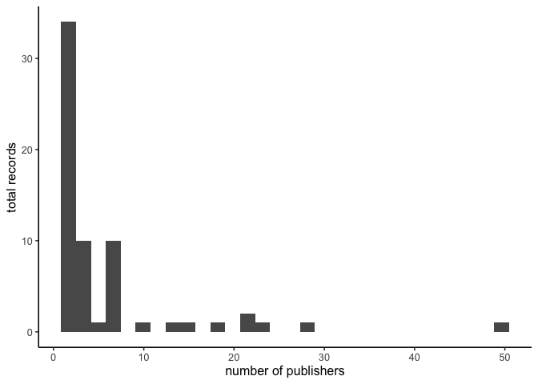
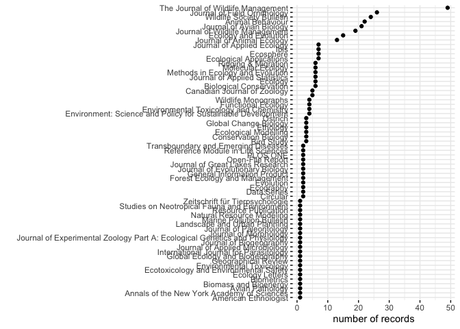

Using GeoDeepDive (xDD) to Track North American Bird Banding Laboratory
Citations
================
Last updated: 2019-12-16

## About

This project seeks to identify publications within which the [USGS North
American Bird Banding
Laboratory](https://www.usgs.gov/centers/pwrc/science/bird-banding-laboratory)
has been referenced or mentioned. This project uses pre-extracted
information available via API from the
[GeoDeepDive](https://geodeepdive.org) infrastructure.

## Overview of BBL in records available in the GeoDeepDive database.

We can use various search terms to identify potential uses of the BBL
data or results in the literature. We exluded the term “BBL” here as
this yields irrelevant references.
<!-- For example, here we found 15373 unique publications which used the terms North American Bird Banding Laboratory, Bird Banding Laboratory, Bird Banding Lab, BBL. However, "BBL" is a common acronym in oil and gas and other fields. We can coarsely try to control for this by removing references to "oil" or "gas" in the highlights--this results in 11792 unqiue records -- this still leaves us with a lot of irrelevant publications. For our purposes, we will work only with the 319 records associated with the following search terms: -->

| Exact search phrase                      | Number of unique records in xDD/GDD |
| ---------------------------------------- | ----------------------------------- |
| “North American Bird Banding Laboratory” | 8                                   |
| “Bird Banding Laboratory”                | 270                                 |
| “Bird Banding Lab”                       | 68                                  |

Check out the use of the terms over time:
<!-- -->

We can visualize the distribution of records among unique publishers.
Few publications contain the bulk of the records.
<!-- -->

Viewing the publications with at least 25 unique records:
<!-- -->

## This project relies on the UW Deepdive Infrastructure

[Original branch from which this repository was
forked](UW-Deepdive-Infrastructure/app-template). Check out [the
wiki](https://github.com/UW-Deepdive-Infrastructure/app-template/wiki)
for more information on getting started.

## USGS Provisional Software

This software is preliminary or provisional and is subject to revision.
It is being provided to meet the need for timely best science. The
software has not received final approval by the U.S. Geological Survey
(USGS). No warranty, expressed or implied, is made by the USGS or the
U.S. Government as to the functionality of the software and related
material nor shall the fact of release constitute any such warranty. The
software is provided on the condition that neither the USGS nor the U.S.
Government shall be held liable for any damages resulting from the
authorized or unauthorized use of the software.
