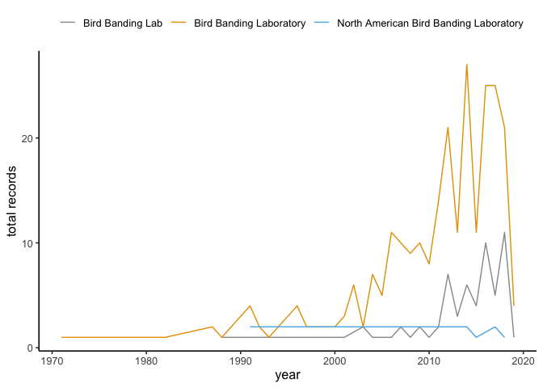
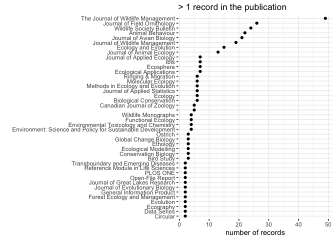

Using GeoDeepDive (xDD) to Track North American Bird Banding Laboratory
Citations
================
Last updated: 2019-12-16

## About

This project seeks to identify publications within which the [USGS North
American Bird Banding
Laboratory](https://www.usgs.gov/centers/pwrc/science/bird-banding-laboratory)
has been referenced or mentioned. This project uses pre-extracted
information available via API from the
[GeoDeepDive](https://geodeepdive.org) infrastructure.

## Overview of BBL in records available in the GeoDeepDive database.

We can use various search terms to identify potential uses of the BBL
data or results in the literature. We exluded the term “BBL” here as
this yields irrelevant references.
<!-- For example, here we found 15373 unique publications which used the terms North American Bird Banding Laboratory, Bird Banding Laboratory, Bird Banding Lab, BBL. However, "BBL" is a common acronym in oil and gas and other fields. We can coarsely try to control for this by removing references to "oil" or "gas" in the highlights--this results in 11792 unqiue records -- this still leaves us with a lot of irrelevant publications. For our purposes, we will work only with the 319 records associated with the following search terms: -->

| Exact search phrase                      | Number of unique records in xDD/GDD |
| ---------------------------------------- | ----------------------------------- |
| “North American Bird Banding Laboratory” | 8                                   |
| “Bird Banding Laboratory”                | 270                                 |
| “Bird Banding Lab”                       | 68                                  |

Check out the use of the terms over time:
<!-- -->

We can visualize the distribution of records among unique publishers.
Few publications contain the bulk of the records.
<!-- -->

Viewing the publications with at least 25 unique records:
<!-- -->

## Results Files

Overviews of the results can be found in the [results](/results) folder
in this repository.

### Total records per publication

Here is a comprehensive list of all publications with relevant terms
(except
“BBL”):

| pubname                                                                    | count |
| :------------------------------------------------------------------------- | ----: |
|                                                                            |     5 |
| American Ethnologist                                                       |     1 |
| Animal Behaviour                                                           |    22 |
| Annals of the New York Academy of Sciences                                 |     1 |
| Avian Pathology                                                            |     1 |
| Biological Conservation                                                    |     7 |
| Biomass and Bioenergy                                                      |     1 |
| Biometrics                                                                 |     1 |
| Bird Study                                                                 |     3 |
| Canadian Journal of Zoology                                                |     5 |
| Circular                                                                   |     2 |
| Conservation Biology                                                       |     3 |
| Data Series                                                                |     2 |
| Ecography                                                                  |     2 |
| Ecological Applications                                                    |     7 |
| Ecological Modelling                                                       |     3 |
| Ecology                                                                    |     6 |
| Ecology and Evolution                                                      |    15 |
| Ecology Letters                                                            |     1 |
| Ecosphere                                                                  |     7 |
| Ecotoxicology and Environmental Safety                                     |     1 |
| Environment: Science and Policy for Sustainable Development                |     4 |
| Environmental Toxicology                                                   |     1 |
| Environmental Toxicology and Chemistry                                     |     4 |
| Ethology                                                                   |     3 |
| Evolution                                                                  |     2 |
| Forest Ecology and Management                                              |     2 |
| Functional Ecology                                                         |     4 |
| General Information Product                                                |     2 |
| Geographical Review                                                        |     1 |
| Global Change Biology                                                      |     3 |
| Global Ecology and Biogeography                                            |     1 |
| Ibis                                                                       |     7 |
| International Journal for Parasitology                                     |     1 |
| Journal of Animal Ecology                                                  |    13 |
| Journal of Applied Ecology                                                 |     7 |
| Journal of Applied Microbiology                                            |     1 |
| Journal of Applied Statistics                                              |     6 |
| Journal of Avian Biology                                                   |    21 |
| Journal of Biogeography                                                    |     1 |
| Journal of Evolutionary Biology                                            |     2 |
| Journal of Experimental Zoology Part A: Ecological Genetics and Physiology |     1 |
| Journal of Field Ornithology                                               |    28 |
| Journal of Great Lakes Research                                            |     2 |
| Journal of Morphology                                                      |     1 |
| Journal of Paleontology                                                    |     1 |
| Journal of Wildlife Management                                             |    19 |
| Landscape and Urban Planning                                               |     1 |
| Marine Pollution Bulletin                                                  |     1 |
| Methods in Ecology and Evolution                                           |     6 |
| Molecular Ecology                                                          |     6 |
| Natural Resource Modeling                                                  |     1 |
| Open-File Report                                                           |     2 |
| Ostrich                                                                    |     3 |
| PLOS ONE                                                                   |     2 |
| Reference Module in Life Sciences                                          |     2 |
| Resource Publication                                                       |     1 |
| Ringing & Migration                                                        |     6 |
| Studies on Neotropical Fauna and Environment                               |     1 |
| The Journal of Wildlife Management                                         |    49 |
| Transboundary and Emerging Diseases                                        |     2 |
| Wildlife Monographs                                                        |     4 |
| Wildlife Society Bulletin                                                  |    24 |
| Zeitschrift für Tierpsychologie                                            |     1 |

## This project relies on the UW Deepdive Infrastructure

[Original branch from which this repository was
forked](UW-Deepdive-Infrastructure/app-template). Check out [the
wiki](https://github.com/UW-Deepdive-Infrastructure/app-template/wiki)
for more information on getting started.

## USGS Provisional Software

This software is preliminary or provisional and is subject to revision.
It is being provided to meet the need for timely best science. The
software has not received final approval by the U.S. Geological Survey
(USGS). No warranty, expressed or implied, is made by the USGS or the
U.S. Government as to the functionality of the software and related
material nor shall the fact of release constitute any such warranty. The
software is provided on the condition that neither the USGS nor the U.S.
Government shall be held liable for any damages resulting from the
authorized or unauthorized use of the software.
